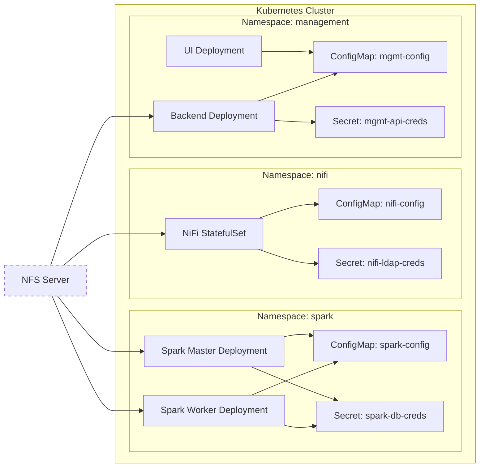

# TMS MEP Detection and Analysis

Automated detection and analysis of Motor Evoked Potentials (MEPs) from TMS experiments in non-human primates.

## Installation

```bash
git clone https://github.com/yourusername/tms_detection
cd tms_detection
pip install -r requirements.txt
```

1.
```bash
python detection.py /Users/cameroncronheimer/Desktop/tms_detection/Nov5_Olive

python epoch.py /Users/cameroncronheimer/Desktop/tms_detection/Nov5_Olive

```
2. 
```bash
python analysis.py /Users/cameroncronheimer/Desktop/tms_detection/Nov5_Olive
```


